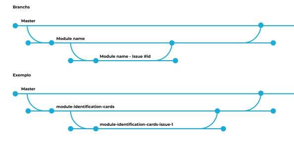

<p align="center">
  <a href="https://www.ipvc.pt/" target="blank"></a>
</p>
<p align="center">
    <strong>
        IPVC <a href="http://nodejs.org" target="_blank">Node.js</a> API Guide, with <a href="https://nestjs.com/" target="_blank">NestJS</a>
    </strong>
</p>

# Install Dependencies 
```npm i --force```

## Structure

### Prisma

#### schema generated
For generatew that shema you have to write the following commands for introspect the changes in  db

```npx prisma db pull```

```npx prisma generate```

Then correct all the errors(normally with @ignore atribbute) and run again: 
```npx prisma generate```

```prisma
model example1 {
  id_example       Int                @id @default(autoincrement())
  nome             String             @db.VarChar(100)
  password         String             @db.VarChar(100)
  age              Int
}
```

#### Prisma Module & Service
```bash
nest generate module prisma --no-spec
nest generate service prisma --no-spec
```

```typescript
export class PrismaService extends PrismaClient {
  constructor(config: ConfigService) {
    super({
      datasources: {
        db: {
          url: config.get('DATABASE_URL')
        }
      }
    });
  }
}
```

### Controllers, Services and Module
```bash
npx nest generate module gpedidos/example1 --no-spec
npx nest generate controller gpedidos/example1 --no-spec
npx nest generate service gpedidos/example1 --no-spec
```

### DTOs

A DTO (Data Transfer Object) is a simple container for holding and moving data between different parts of a software program. It may work as a representation of database table.

```bash
cd src/gpedidos/example1
mkdir dto
cd dto
touch example.dto.ts
touch index.ts
```
#### example.dto.ts

```typescript
export class ExampleDto {
  @IsString()
  @IsNotEmpty() // means field is mandatory
  name: string
  @IsString()
  @IsNotEmpty()
  password: string
  @IsNumber()
  @IsNotEmpty()
  age: number
}
```

#### index.ts

```typescript
export * from './example.dto.ts'
```

### Module

```typescript
@Module({
  providers: [Exemplo1Service],
  controllers: [Exemplo1Controller]
})
export class Exemplo1Module {}
```

### Service
Example of methods to be called on the Controller
```typescript
@Injectable()
export class Example1Service {
  constructor(private prisma: PrismaService) {
  }
  
  //GET
  getAllExamples(){
    return this.prisma.example1.findMany({
      //Don't need the select if you want to get all the info
      //In this case I didn't want to select password
      select: {
        name: true,
        age: true
      }
    })
  }
  
  //POST
  createExample(dto: ExampleDto){
    return this.prisma.example1.create({
      data: {
        name: dto.name,
        password: dto.password,
        age: dto.age
      }
    })
  }

  //PATCH
  async updateExample(id: number, dto: ExampleDto){
    const example = await this.prisma.example1.findUnique({
      where: {
        id_example: id
      }
    })
    
    if (!example){
      return {
        "Error": "example doesn't exist"
      }
    }
    
    return this.prisma.example1.update({
      where: {
        id_example: id
      },
      data: {
        ...dto
      }
    })
  }
  
  //DELETE
  async deleteExample(id: number){
    const example = await this.prisma.example1.findUnique({
      where: {
        id_example: id
      }
    })

    if (!example){
      return {
        "Error": "example doesn't exist"
      }
    }
    
    return this.prisma.example1.delete({
      where: {
        id_example: id
      }
    })
  }
}
```

### Controller
Calling the methods available on the Service
```typescript
@ApiTags('Gestão de Pedidos:States') // In order to do the correct documentation, first we put the top level, and second the sublevel of the endpoint of each controller
@Controller('examples')
export class Example1Controller {
  constructor(private example1Service: Example1Service) {
  }

  @Get()
  getExamples() {
    return this.example1Service.getAllExamples();
  }

  @Post()
  createExample(@Body() dto: ExampleDto) {
    return this.example1Service.createExample(dto);
  }

  @Patch(':id')
  updateExample(@Param('id', ParseIntPipe) id: number, @Body() dto: ExampleDto){
    return this.example1Service.updateExample(id, dto);
  }
  
  @Delete(':id')
  deleteExample(@Param('id', ParseIntPipe) id: number){
    return this.example1Service.deleteExample(id);
  }
}
  ```


  ## Specific Endpoints

  When you have specific endpoints you must do some documentation(a description of method or the general endpoit)

  ### Description of the endpoint 
  ```js
  document.tags = [
    { name: 'Gestão de Pedidos', description: 'Este endpoint está relacionado com a gestão de serviços' }, //Description of the subject of the endpoints
    { name: 'Gestão de Pedidos:States', description: 'Este endpoint está relacionado com a gestão de serviços' } // Description of the endpoint
  ];
  ```

  ### Decription of the method

  ```js
    //This is the description of the endpoint
    @ApiOperation({description: "This is the main Description of an Endpoint."})
    //This is the description of the response of the server
    @ApiResponse({ status: 200, description: 'Este método faz a obtenção de todas as categorias'})
    @Get()
    getEstados(){
        return this.estadosService.getEstados();
    }

  ```

## Issue and Branch Organization

### Branch Structure

<p align="center">
  
</p>

#### 1. **Master Branch**
The `master` branch is the main branch that contains the entire codebase and serves as the base for all development.

#### 2. **Module Branches**
For each module currently under development, we create a dedicated branch. These branches are children of the `master` branch and contain all the code for their respective modules. The naming convention for these branches is:

Example:
- `module-identification-cards`
- `module-ugp`

#### 3. **Issue/Task Branches**
For each issue or task related to a specific module, a branch is created as a child of the corresponding module branch. These branches focus on implementing features, fixing bugs, or addressing specific tasks for the module. The naming convention for these branches is:

Example:
- `module-identification-cards-issue-1`
- `module-ugp-issue-2`

### Development Flow

1. Identify the module related to the task and ensure its branch exists (e.g., `module-name`).
2. Create a new issue for the task and tag it with the appropriate labels (e.g., Bug, Enhancement, or module-specific labels like Module identification-cards).
3. Create a branch for the task using the naming convention: `module-name-issue-#id`.
4. Move task to `in-progress` column.
5. Implement the required changes in the new branch. 
6. When the task is complete, open a pull request to merge the issue branch into the corresponding module branch and assign a reviewer. 
7. Move task to `testing` column.
8. Once all tasks for a module are complete and tested, open a pull request to merge the module branch into master.
